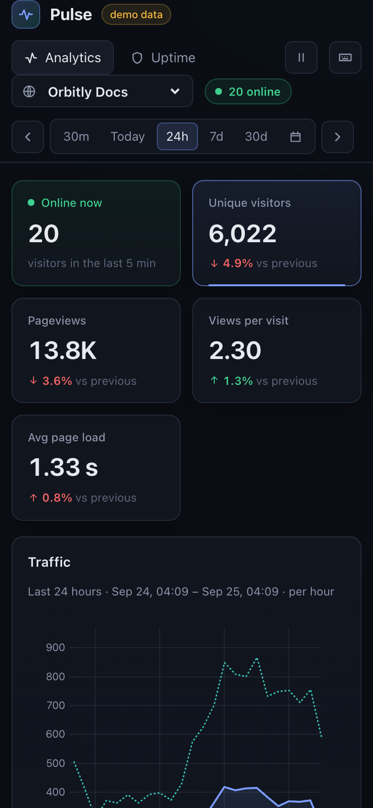

# Pulse — real-time web analytics & uptime monitoring

[](https://github.com/sinnercode228/pulse-analytics/actions/workflows/ci.yml)
[](https://sinnercode228.github.io/pulse-analytics/)

**Live demo:** https://sinnercode228.github.io/pulse-analytics/ — runs fully in the browser, no backend.

> **Демо-проект / Demo project.** «Pulse» и все сайты/сервисы в демо (Orbitly, Kestrel, Fernwood) — вымышленные; данные синтетические.
> Pulse and every site/service in the demo are fictional; all data is synthetic.


---

## Русский

**Pulse** — приватная (без cookies) веб-аналитика в реальном времени и мониторинг доступности в одном дашборде.
Трекер < 1 КБ отправляет просмотры в Fastify, события сворачиваются в роллапы (минута / час / день) с HyperLogLog-скетчами уникальных посетителей,
дашборд получает живой поток через WebSocket. Отдельный воркер проверяет HTTP-эндпоинты, ведёт инциденты и 90-дневную историю.

### Возможности

- **Дашборд** (React 19 + Vite + TypeScript, тёмная тема): посетители онлайн, KPI со сравнением с предыдущим периодом,
  график на **uPlot**, топ страниц / источников / стран / устройств / браузеров.
- **Виртуализированные таблицы** (`@tanstack/react-virtual`) — тысячи строк без лагов; поиск, сортировка, **экспорт в CSV**.
- **Выбор периода**: пресеты (30 мин, сегодня, 24 ч, 7 д, 30 д), произвольный диапазон, сдвиг окна ←/→. Гранулярность выбирается автоматически.
- **Realtime**: поминутные бары за 30 минут + живая лента просмотров.
- **Uptime**: статус, спарклайн времени ответа за 24 ч, **тепловая карта за 90 дней**, p50/p95, инциденты, журнал проверок.
- **Горячие клавиши**: `?` — справка, `A`/`U` — разделы, `1–5` — периоды, `←/→`, `S` — сайт, `/` — поиск, `E` — CSV, `L` — пауза.
- **Демо на GitHub Pages без бэкенда**: тот же движок роллапов/запросов (`packages/core`) работает в **Web Worker**, генерирует 30 дней
  реалистичного трафика (сезонность, всплески с HN/рассылок, Zipf-распределение страниц) и продолжает стримить события в реальном времени.
  Переключение на реальный API — конфигом (`VITE_DATA_SOURCE=api`) или параметром `?source=api&api=https://…`.

### Архитектура

```
packages/core   изоморфный движок: HyperLogLog, time-buckets с часовыми поясами, RollupBuilder,
                RollupRepository (merge-on-upsert), query-слой, математика аптайма, синтетические генераторы
server/         Fastify 5: POST /api/event, REST-статистика, WebSocket /api/live, CSV-экспорт, admin API,
                SQLite (встроенный node:sqlite, WAL), uptime-checker (inline или отдельный процесс), трекер p.js
web/            React-дашборд; DataSource = ApiDataSource (HTTP+WS) | DemoDataSource (Web Worker)
```

- **Путь записи:** трекер → `POST /api/event` (text/plain, без CORS preflight) → анонимный ID посетителя
  `hash(суточная соль, сайт, IP, UA)` (соль ротируется, IP не хранится) → `RollupBuilder` в памяти → пакетный flush в SQLite.
- **Хранилище:** таблица `rollups` работает как AggregatingMergeTree — HLL-скетчи мёрджатся при upsert,
  поэтому «уникальные посетители» корректны для любого диапазона. TTL по уровням: минуты — 2 дня, часы — 35 дней, дни — бессрочно.
- **Чтение:** запросы делают `flush()` перед чтением (read-your-writes), диапазоны выравниваются по бакетам,
  текущий и предыдущий период не пересекаются.
- **Uptime:** `performCheck` (таймауты, сетевые ошибки → failed check) → сырые проверки + дневные роллапы + state-machine инцидентов.

### Запуск

Требования: Node ≥ 22.13 (используется встроенный `node:sqlite`; проверено на Node 25).

```bash
npm install
npm run dev                 # только дашборд в демо-режиме: http://localhost:5173
```

С реальным бэкендом:

```bash
npm run seed                # 30 дней синтетической истории в ./server/data/pulse.db
npm run dev:api             # API на :8787 (трекер: http://localhost:8787/p.js)
VITE_DATA_SOURCE=api npm run dev   # дашборд проксирует /api и WebSocket на :8787
npm run simulate -w @pulse/server  # (опц.) живой синтетический трафик через настоящий /api/event
```

Подключение трекера на сайт:

```html
<script defer src="https://pulse.example.com/p.js" data-site="my-site"></script>
```

Docker (API + дашборд + трекер на :8787, uptime-воркер отдельным сервисом):

```bash
docker compose up -d --build
docker compose run --rm seed      # опционально: демо-данные
```

Проверки: `npm run check` (lint + prettier + typecheck + тесты + сборка). Переменные окружения — в [.env.example](.env.example).

### Тесты

**97 тестов** (Vitest), Docker не нужен:

- `packages/core` (52): HyperLogLog (точность, merge, сериализация), часовые пояса/DST, роллапы, query-слой, аптайм, генераторы.
- `server` (26): API через `fastify.inject` (приём событий, боты, валидация, сводка, таймсерии, разбивки, CSV, realtime, admin-токен),
  WebSocket live-feed на реальном сокете, SQLite-репозиторий (паритет с in-memory, merge HLL, TTL), uptime-чекер,
  **бюджет размера трекера** (≤ 2048 Б минифицированный; сейчас ~840 Б / ~560 Б gzip) и поведение трекера в песочнице (SPA-навигация, opt-out).
- `web` (19): движок демо в воркере, компоненты (виртуальная таблица, KPI, тепловая карта), хоткеи, API-клиент, утилиты.

### Демо на GitHub Pages

Workflow [`.github/workflows/pages.yml`](.github/workflows/pages.yml) собирает `web/` с `base: '/<repo>/'` и публикует
через `actions/upload-pages-artifact` + `actions/deploy-pages`. В настройках репозитория: **Settings → Pages → Source: GitHub Actions**.

---

## English

**Pulse** is cookieless, real-time web analytics plus uptime monitoring in one dashboard. A < 1 KB tracker sends pageviews to
a Fastify ingestion API; events are folded into minute/hour/day rollups with HyperLogLog visitor sketches, and the dashboard
receives a live stream over WebSocket. A checker worker probes HTTP endpoints, tracks incidents and keeps 90 days of history.

### Features

- **Dashboard** (React 19 + Vite + TypeScript, dark UI): visitors online, KPIs with period-over-period change,
  **uPlot** time-series, top pages / referrers / countries / devices / browsers.
- **Virtualized tables** with search, sortable columns and **CSV export**.
- **Date-range picker**: presets, custom range, ←/→ window shifting; minute/hour/day granularity is picked automatically.
- **Realtime** per-minute bars and a live pageview feed.
- **Uptime**: status, 24h response-time sparklines, **90-day status heatmap**, p50/p95, incidents, check log.
- **Keyboard shortcuts** — press `?` in the app.
- **Backend-free Pages demo**: the very same rollup/query engine (`packages/core`) runs in a **Web Worker**, backfills 30 days of
  realistic synthetic traffic (weekly/diurnal seasonality per time zone, launch spikes, Zipf page popularity, log-normal load times)
  and keeps streaming events live. Switch to the real API with `VITE_DATA_SOURCE=api` or `?source=api&api=https://…`.

### Architecture

- **Write path:** tracker → `POST /api/event` (text/plain beacon, no CORS preflight) → anonymous visitor id
  `hash(daily salt, site, IP, UA)` (salt rotates daily, IPs are never stored) → in-memory `RollupBuilder` → batched flush to SQLite.
- **Storage:** the `rollups` table behaves like an AggregatingMergeTree — HLL sketches merge on upsert, so unique visitors are
  correct for any range. Tiered TTL: minute 2 days, hour 35 days, day forever. SQLite via the built-in `node:sqlite` (no native addon), WAL mode.
- **Read path:** queries flush first (read-your-writes); ranges snap to bucket boundaries so the current and previous period never overlap.
- **Uptime:** `performCheck` (timeouts and network errors become failed checks) → raw checks + daily rollups + incident state machine;
  runs inline in the API (`UPTIME_MODE=inline`) or as a separate `uptime-worker` process sharing the database.
- **Frontend:** a single `DataSource` interface with two implementations — `ApiDataSource` (HTTP + reconnecting WebSocket) and
  `DemoDataSource` (typed RPC to the worker). Zustand for UI state, URL hash for linkable views (`#/uptime/<monitor>`).

### Getting started

```bash
npm install
npm run dev                         # demo-mode dashboard at http://localhost:5173
npm run seed && npm run dev:api     # API on :8787 with 30 days of synthetic history
VITE_DATA_SOURCE=api npm run dev    # dashboard against the API (Vite proxies /api + WebSocket)
docker compose up -d --build        # API + dashboard + tracker on :8787, separate uptime worker
```

API overview: `GET /api/sites`, `GET /api/sites/:id/{summary,timeseries,breakdown,realtime,export.csv}?from&to`,
`GET /api/monitors`, `GET /api/monitors/:id`, `GET /api/live?site=` (WebSocket), `POST /api/event`,
`POST /api/admin/{sites,monitors}` (Bearer `ADMIN_TOKEN`), `GET /p.js`, `GET /api/health`.

### Tests & quality

97 Vitest tests (core 52 · server 26 · web 19), no Docker required: `npm test`. `npm run check` runs ESLint, Prettier,
TypeScript (strict, `noUncheckedIndexedAccess`), tests and all builds; the same steps run in [CI](.github/workflows/ci.yml) on Node 22 and 24.
The tracker has a hard **2 KB** size budget enforced by both the build and a test (currently ~840 B minified, ~560 B gzipped).

### Screenshots

| Uptime | Mobile |
| --- | --- |
|  |  |

### Stack

TypeScript · React 19 · Vite · uPlot · TanStack Virtual · Zustand · Fastify 5 · @fastify/websocket · node:sqlite · esbuild · Vitest · Testing Library · Docker · GitHub Actions

---

Author: [sinnercode228](https://github.com/sinnercode228) · Telegram [@sinnercode](https://t.me/sinnercode) · MIT License
