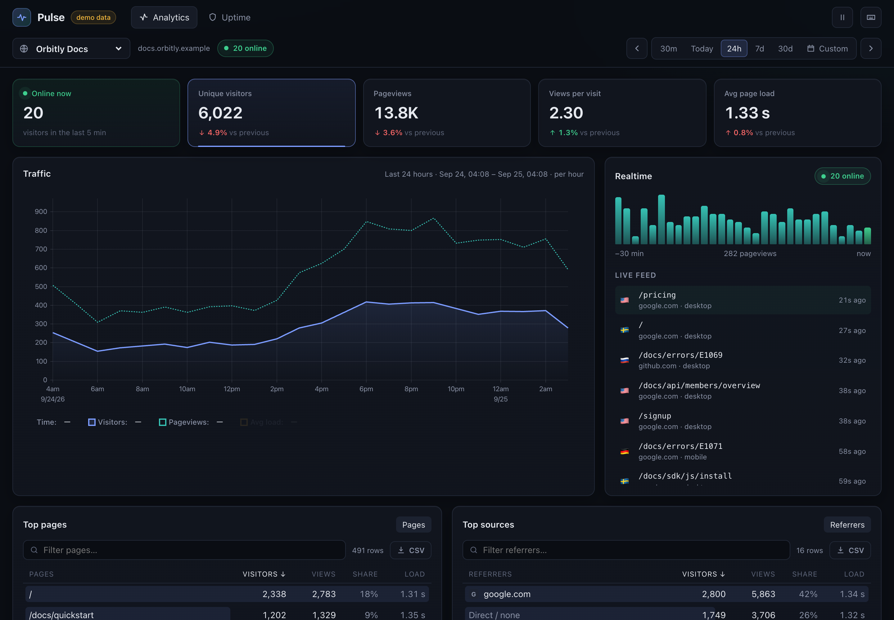
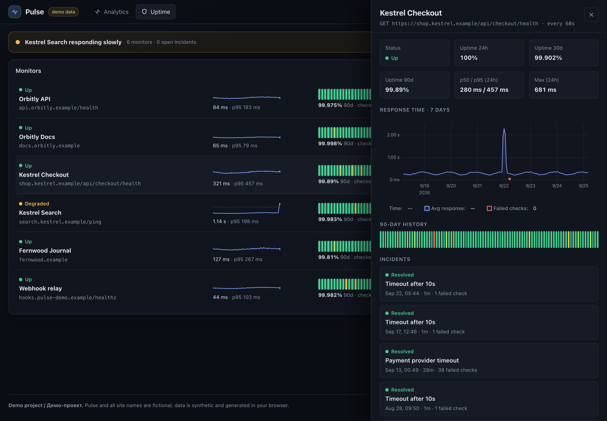

# Pulse

Pulse — веб-аналитика без cookies и мониторинг аптайма в одном дашборде. Трекер весит 843 байта после минификации (560 в gzip) и шлёт просмотры в Fastify, а сервер сворачивает их в поминутные, почасовые и дневные роллапы в SQLite и стримит живую ленту по WebSocket.



Демо без бэкенда: https://sinnercode228.github.io/pulse-analytics/

В демо работает тот же движок из `packages/core`, что и на сервере. `DemoEngine` ([`web/src/data/demo/engine.ts`](web/src/data/demo/engine.ts)) прогоняет трафик через `RollupBuilder` и те же функции запросов, только хранилище у него в памяти, с тем же интерфейсом, что у SQLite-репозитория. История за 30 дней генерируется при первом запросе к сайту, дальше движок раз в секунду досчитывает новый трафик. Всё это крутится в Web Worker ([`DemoDataSource.ts`](web/src/data/demo/DemoDataSource.ts)), чтобы генерация и запросы не блокировали UI-поток. Сайты (Orbitly, Kestrel, Fernwood) и трафик в демо синтетические. С `?source=api&api=https://…` в адресе тот же дашборд ходит в настоящий API.

Pulse написан на TypeScript в npm workspaces. `packages/core` — движок без зависимостей, общий для сервера и браузера; `server` — Fastify 5, `@fastify/websocket`, встроенный `node:sqlite` и esbuild для трекера; `web` — React 19, Vite, uPlot, TanStack Virtual и Zustand.

## Путь одного просмотра

Трекер ([`server/tracker/tracker.ts`](server/tracker/tracker.ts)) срабатывает после `load`, а в SPA ещё на `pushState`, `replaceState` и `popstate`. Тело уходит через `navigator.sendBeacon` строкой (`text/plain`), поэтому запрос обходится без CORS preflight; если `sendBeacon` нет или он вернул `false`, то же самое уходит через `fetch` с `keepalive`. `POST /api/event` ([`server/src/routes/ingest.ts`](server/src/routes/ingest.ts)) отвечает 404 на неизвестный сайт и 422 на URL не с домена сайта или его поддомена, и [`misc.test.ts`](packages/core/test/misc.test.ts) проверяет, что `acme.example.evil.test` за `acme.example` не сойдёт. Сверяется URL из тела запроса, так что от подделки это не защищает. Ботам (пустой или короче 10 символов User-Agent либо совпадение с `BOT_RE` из [`packages/core/src/ua.ts`](packages/core/src/ua.ts)) сервер отвечает 202, чтобы они не повторяли запрос, и выбрасывает событие.

Дальше `IngestPipeline` ([`server/src/ingest/pipeline.ts`](server/src/ingest/pipeline.ts)) складывает событие в `RollupBuilder` в памяти. Один просмотр трогает 18 строк буфера (три уровня на шесть срезов: total, page, referrer, country, device, browser), и новая строка появляется только для нового бакета или значения, иначе растут счётчики и скетч существующей. Буфер уходит в SQLite одной транзакцией раз в 2 секунды или при 5 000 строк, а любой запрос статистики сначала вызывает `flush()` ([`server/src/stats/service.ts`](server/src/stats/service.ts)), поэтому принятый просмотр сразу виден в отчётах; при падении процесса теряется то, что пришло после последнего сброса. Параллельно `LiveHub` ([`server/src/live/hub.ts`](server/src/live/hub.ts)) шлёт просмотр по WebSocket, и на дашборде обновляются живая лента и «Online now», число посетителей за последние 5 минут ([`active.ts`](packages/core/src/active.ts)). Графики и KPI дашборд перезапрашивает раз в 10 секунд, пока окно доходит до «сейчас» и вкладка видна.

## Кого считать одним посетителем

Трекер ничего не сохраняет в браузере, только читает флаг `localStorage.pulse_ignore`, которым можно исключить свои визиты. Id посетителя — `hash32("соль|сайт|ip|ua")`, посчитанный дважды, с seed 1 и 2; оба числа в base36 склеиваются в одну строку ([`server/src/ingest/parse.ts`](server/src/ingest/parse.ts)). Соль — 16 случайных байт на UTC-сутки в таблице `salts`; когда создаётся новая, всё старше вчерашней удаляется ([`server/src/ingest/salt.ts`](server/src/ingest/salt.ts)). Соль лежит в базе, а не в памяти процесса, и перезапуск посреди дня не меняет id. IP и строка User-Agent в базу не пишутся, только хэш, а страна берётся из заголовков CDN вроде `cf-ipcountry`, своей геолокации по IP нет. В логи IP всё же попадает, потому что стандартный лог запросов Fastify (включён в [`server/src/index.ts`](server/src/index.ts)) пишет `remoteAddress`.

Из-за суточной соли один и тот же человек в разные дни получает разные id, и «Unique visitors» за диапазон в несколько дней ближе к числу посетитель-дней, чем к числу людей. Ещё соль меняется в полночь UTC, а дневные бакеты режутся по полуночи часового пояса сайта. Если пояс не UTC (по умолчанию он UTC), посетитель, заходивший до и после полуночи UTC в пределах одних местных суток, попадёт в дневной бакет дважды.

## Скетч в каждой строке роллапа

Посетителей нельзя просто сложить между бакетами, поэтому в каждой строке роллапа лежит HyperLogLog-скетч ([`packages/core/src/hll.ts`](packages/core/src/hll.ts)): precision 11, 2048 регистров, ~2,3% стандартной ошибки. Пока хэшей не больше 512, скетч хранит их точным множеством 32-битных значений, как sparse-режим в HLL++, а у строк вида «одна страница за один час» так обычно и бывает. На 513-м он переходит в плотные регистры, потому что 512 значений по 4 байта занимают столько же, сколько 2048 однобайтовых регистров (2 КиБ). В SQLite скетч лежит в BLOB-колонке. Тесты в [`packages/core/test/hll.test.ts`](packages/core/test/hll.test.ts) требуют, чтобы 300 значений в sparse-режиме считались точно, на 100 000 ошибка была меньше 3%, а объединение двух множеств по 4 000 с пересечением в 2 000 давало 6 000 с точностью до 4%.

Скетчи мёржатся, и таблица `rollups` ведёт себя как `AggregatingMergeTree` с `uniqState`/`uniqMerge` в ClickHouse. `upsert` читает существующую строку, объединяет скетчи, складывает счётчики и пишет обратно внутри одной транзакции ([`server/src/db/rollup-repo.ts`](server/src/db/rollup-repo.ts)), поэтому flush может писать частичные агрегаты сколько угодно раз. Тест [`server/test/rollup-repo.test.ts`](server/test/rollup-repo.test.ts) пишет двое суток синтетики в SQLite пачками по 1 500 событий, а в in-memory хранилище одной пачкой, и сверяет summary, timeseries и breakdown через `toEqual`.

Хэш — MurmurHash3 (x86, 32 бит) на `Math.imul` ([`packages/core/src/hash.ts`](packages/core/src/hash.ts)). В Node и в браузере он даёт одно и то же, и из одних данных сервер и демо строят побайтно одинаковые скетчи.

## Три уровня хранения

Сырые просмотры не хранятся совсем, только роллапы ([`packages/core/src/store.ts`](packages/core/src/store.ts)):

| Уровень | Сколько хранится | Выбирается автоматически, если |
| --- | --- | --- |
| `minute` | 2 дня | окно ≤ 3 ч 1 мин и начинается не раньше чем 2 дня назад |
| `hour` | 35 дней | окно ≤ 8 дней 1 ч и начинается не раньше чем 35 дней назад |
| `day` | без срока | во всех остальных случаях |

`chooseInterval` ([`packages/core/src/query.ts`](packages/core/src/query.ts)) берёт самый мелкий уровень, при котором на графике не больше ~200 точек и данные ещё не удалены. Чистка идёт раз в час и оставляет лишний час, чтобы окно, начинающееся ровно на границе хранения, не потеряло первый бакет.

Каждая строка роллапа описывает одно измерение, поэтому разрез возможен только по одному за раз. «Страница × страна» или новое измерение задним числом не посчитать, сырых событий для этого нет.

## Где время врёт

### Округление диапазона

Оба конца окна округляются вниз до границы бакета ([`packages/core/src/query.ts`](packages/core/src/query.ts)), и текущий с предыдущим периодом никогда не делят один бакет. Окно, которое доходит до «сейчас», сохраняет незаконченный бакет, иначе свежие данные пропали бы с графика.

### +3000% к периоду, которого не было

KPI сравниваются с окном той же длины прямо перед текущим. Если истории на это окно не хватает, дельта выходит бессмысленной. Пример из комментария к `queryPreviousSummary`:

> Without this, a 30-day view over a site with 31 days of data compares against a single day and reports +3000%.

Для окон от суток и длиннее я сначала смотрю первую десятую часть предыдущего периода. Если там ни одного просмотра, возвращается пустая сводка, и дашборд пишет «no previous data» вместо дельты. Эвристика грубая. Сайт, у которого в эти дни и правда не было трафика, тоже получит «no previous data».

### Сутки по 23 и 25 часов

Дневной бакет начинается в местную полночь часового пояса сайта ([`packages/core/src/time.ts`](packages/core/src/time.ts)). Для следующего бакета код прибавляет 26 часов (даже при переводе часов эта точка попадает в следующие местные сутки) и от неё снова берёт полночь. Тест в [`packages/core/test/time.test.ts`](packages/core/test/time.test.ts) проверяет 23- и 25-часовые дни в `America/New_York`.

## Аптайм и второй процесс на той же базе



`performCheck` ([`server/src/uptime/checker.ts`](server/src/uptime/checker.ts)) ловит сетевые ошибки и таймауты и записывает их как неудачную проверку. По умолчанию монитор проверяется раз в минуту с таймаутом 10 секунд, ответ дольше 1 000 мс считается degraded. Сырые проверки живут 7 дней, по дням есть сводка `uptime_daily`, из неё строится полоса за 90 дней с порогами 99,99% / 99% / 95%.

В демо монитор «Webhook relay» по сценарию падает с HTTP 500 примерно через минуту после первого открытия страницы аптайма и через 6 минут поднимается ([`packages/core/src/synth/uptime.ts`](packages/core/src/synth/uptime.ts)). На нём видно, как инцидент открывается и закрывается.

Проверки идут внутри API (`UPTIME_MODE=inline`) или отдельным процессом [`uptime-worker`](server/src/uptime-worker.ts) на том же файле базы. Встроенный `node:sqlite` не требует сборки нативного аддона, а база открывается в режиме WAL, чтобы API и воркер аптайма работали с одним файлом (шапка [`server/src/db/database.ts`](server/src/db/database.ts)). Вместе с WAL выставляются `synchronous = NORMAL` и `busy_timeout = 5000`, схема мигрирует через `PRAGMA user_version`. У отдельного воркера нет `LiveHub`, поэтому в `docker compose` страница аптайма обновляется только перезапросом раз в 10 секунд.

## Что ещё не сделано

- Алертов нет, упавший монитор видно только на дашборде. Инцидент открывает первая неудачная проверка и закрывает первая успешная ([`packages/core/src/uptime.ts`](packages/core/src/uptime.ts)), поэтому один таймаут даёт отдельный инцидент.
- У WebSocket нет ping и backpressure. Клиент переподключается через 1 с × 2ⁿ (до 30 с) без jitter, события за время разрыва не досылаются.
- На `/api/event` нет rate limit. Читающий API открыт без авторизации, `ADMIN_TOKEN` закрывает только `POST /api/admin/*`.
- `TRUST_PROXY` по умолчанию включён. Если перед сервером нет прокси, клиент может подставить свой `X-Forwarded-For`, и этот адрес уйдёт в хэш посетителя.

## Свой экземпляр

Node 24 (`.nvmrc`) или 22.18+: `build:tracker` импортирует `.ts` обычным `node`, а type stripping включён по умолчанию с 22.18.

```bash
npm ci
npm run dev                          # только дашборд на демо-данных: http://localhost:5173

# с бэкендом
npm run seed                         # 30 дней синтетики в server/data/pulse.db: 3 сайта, 6 мониторов на паузе, self-check API
npm run dev:api                      # API и трекер (/p.js) на :8787
VITE_DATA_SOURCE=api npm run dev     # дашборд; Vite проксирует /api и WebSocket на :8787
npm run simulate -w @pulse/server    # живой синтетический трафик через настоящий POST /api/event

# или в Docker
docker compose up -d --build         # API + дашборд + трекер на :8787, аптайм отдельным сервисом
docker compose run --rm seed         # по желанию: 30 дней синтетики в тот же volume
```

Чтобы локально проверки шли отдельным процессом, API запускается с `UPTIME_MODE=off`, а рядом `npm run worker:uptime -w @pulse/server`.

Трекер на сайте:

```html
<script defer src="https://pulse.example/p.js" data-site="my-site"></script>
```

Сайт заводится через `POST /api/admin/sites` с `Authorization: Bearer <ADMIN_TOKEN>`; без `ADMIN_TOKEN` админ-роуты выключены. Сервер берёт переменные только из окружения процесса и `.env` сам не читает; в Docker `ADMIN_TOKEN` из `.env` подставляет compose. Переменные перечислены в [`.env.example`](.env.example), кроме `TRUST_PROXY`: он читается в [`server/src/config.ts`](server/src/config.ts).

## Что проверяет CI

`npm test` гоняет 97 тестов на Vitest: 52 в `packages/core` (HLL, часовые пояса и DST, роллапы, запросы, аптайм, генераторы), 26 в `server` (API через `fastify.inject`, WebSocket на настоящем сокете, паритет SQLite с in-memory, трекер в `node:vm`, CSV с нейтрализацией формул) и 19 в `web` (демо-движок, компоненты, хоткеи, API-клиент, утилиты). `npm run check` — это ESLint с `--max-warnings=0`, Prettier, `tsc`, тесты и сборка; те же шаги идут в CI на Node 22 и 24. Сборка падает, если трекер больше 2 048 байт, а тест вдобавок требует меньше 1 024 байт в gzip.
